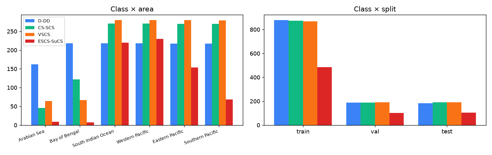
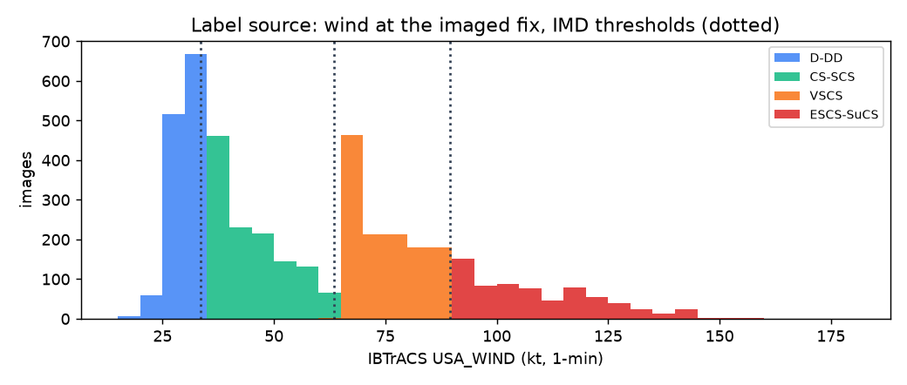
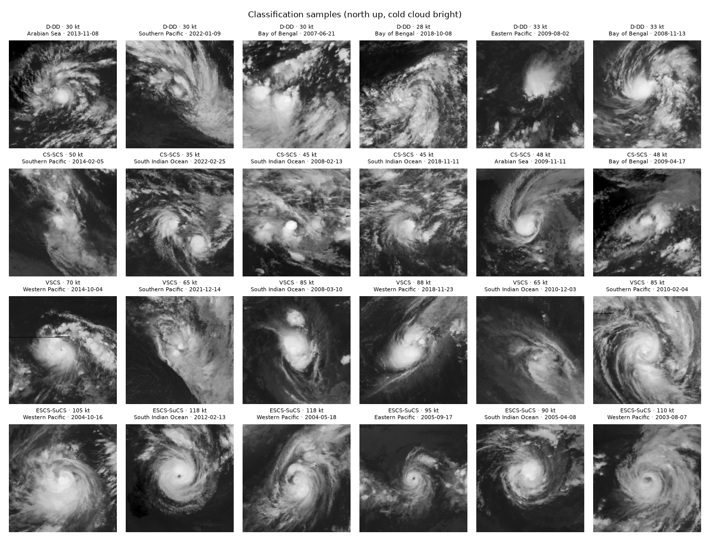

# Classification dataset report — cls-v1.0

Created 2026-09-12T05:16:53+00:00. Generated by `scripts/classification/write_dataset_report.py` from the pipeline outputs.

## Sources and labels
- No pre-labelled intensity image set exists in the project. Fixes come from **Dataset A** (PS-70 finalized IBTrACS metadata);
  the label comes from IBTrACS `USA_WIND` (JTWC/NHC 1-minute sustained wind), the only wind reported on one basis in every basin.
- Rule: IMD category thresholds (kt) applied to IBTrACS USA_WIND; classes in configs/classification.yaml.

| id | code | name | IMD categories | USA_WIND |
|---|---|---|---|---|
| 0 | D-DD | Depression / Deep Depression | Depression, Deep Depression | 17–33 kt |
| 1 | CS-SCS | Cyclonic Storm / Severe Cyclonic Storm | Cyclonic Storm, Severe Cyclonic Storm | 34–63 kt |
| 2 | VSCS | Very Severe Cyclonic Storm | Very Severe Cyclonic Storm | 64–89 kt |
| 3 | ESCS-SuCS | Extremely Severe / Super Cyclonic Storm | Extremely Severe Cyclonic Storm, Super Cyclonic Storm | 90–∞ kt |

- **Label-source check (North Indian Ocean, 3,563 fixes with both winds):** IMD's own 3-minute wind gives the same class 69.6% of the time; the 1-minute label is one class higher in 25.6% and lower in 4.8%. Expect disagreement with official IMD bulletins near class boundaries.

## Candidate funnel
| step | fixes |
|---|---|
| fixes_in_basins_since_min_season | 139,829 |
| main_track | 132,085 |
| tropical_nature_TS | 97,819 |
| synoptic_3_hourly | 96,813 |
| inside_gridsat_coverage | 96,813 |
| usa_wind_missing | 10,444 |
| below_17kt | 306 |
| labelled_fixes | 86,063 |
| labelled_storms | 1,954 |

## Cleaning
- Candidates 5,600; accepted 4,817; rejected 783 ({'not_fetched': 661, 'missing_data_exceeds_limit': 82, 'failed': 40}).
- Exact duplicates 0; near-duplicate pairs 0 (label conflicts dropped: 0). Corrupted images: none (every file decoded).

## Final dataset
- **4,438 images**, 1,704 storms, 1999-12-10T12:00:00Z → 2025-10-09T12:00:00Z.
- Format {'PNG': 4438}, dimensions {'256x256': 4438}, channels {'L': 4438} (IR, single channel).
- Satellite source: NOAA GridSat-B1 v02r01 IRWIN CDR (~11 µm), 18°×18° crops, nearest 3-hourly slot (all fixes are exact slots).
- Class distribution: {'D-DD': 1250, 'CS-SCS': 1250, 'VSCS': 1250, 'ESCS-SuCS': 688}; storms per class {'D-DD': 940, 'CS-SCS': 1039, 'VSCS': 867, 'ESCS-SuCS': 297}.
- Missing values in the manifest: {'subregion': 989, 'wmo_wind_kt': 2204, 'wmo_agency': 2136} (WMO wind is absent where the agency did not report one).

| area | D-DD | CS-SCS | VSCS | ESCS-SuCS |
|---|---|---|---|---|
| Arabian Sea | 162 | 46 | 64 | 9 |
| Bay of Bengal | 218 | 122 | 67 | 7 |
| South Indian Ocean | 218 | 271 | 280 | 220 |
| Western Pacific | 218 | 271 | 280 | 230 |
| Eastern Pacific | 217 | 270 | 280 | 154 |
| Southern Pacific | 217 | 270 | 279 | 68 |

## Split (storm/event grouped)
- StratifiedGroupKFold(n_splits=20, shuffle=True) on label|area; 3 folds test, 3 folds val, rest train. Rows {'train': 3105, 'test': 667, 'val': 666}; storms {'test': 253, 'train': 1192, 'val': 259}; groups 1,608 (largest 17).

| split | D-DD | CS-SCS | VSCS | ESCS-SuCS |
|---|---|---|---|---|
| train | 879 | 873 | 869 | 484 |
| val | 187 | 187 | 191 | 101 |
| test | 184 | 190 | 190 | 103 |

- **Leakage check: PASS** — identical_image_path_across_splits 0, identical_pixels_across_splits 0, near_duplicates_across_splits 0, storm_ids_shared_train_val 0, storm_ids_shared_train_test 0, storm_ids_shared_val_test 0, groups_across_splits 0, overlapping_crops_across_splits 0, manifest_rows_missing_from_splits 0, rows_in_more_than_one_split 0.

## Figures

