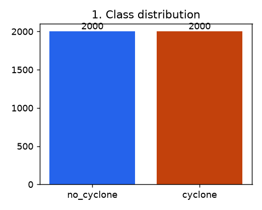
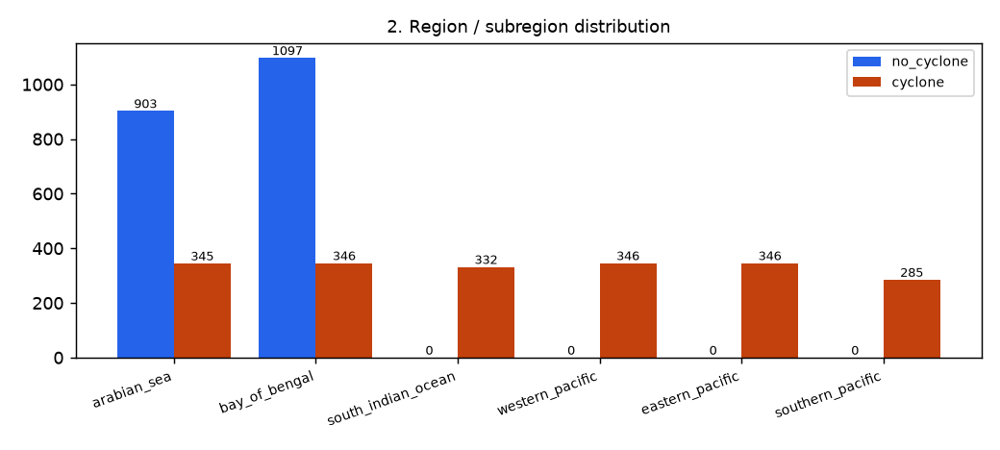
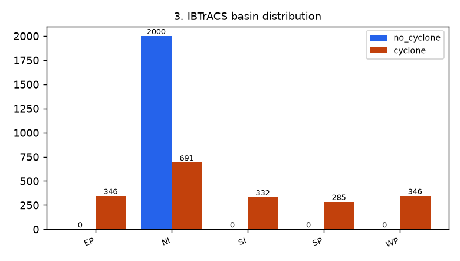
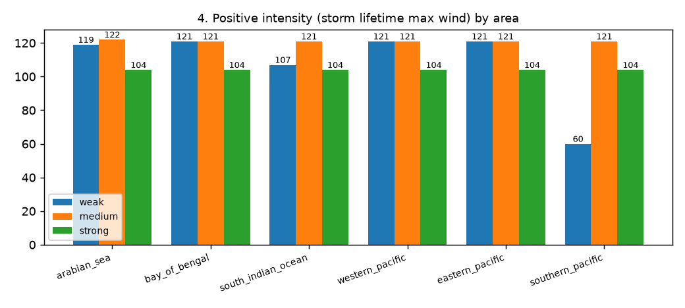
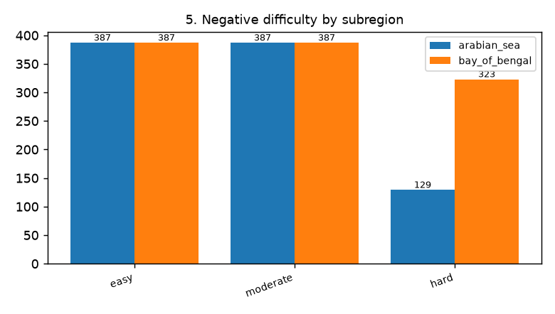
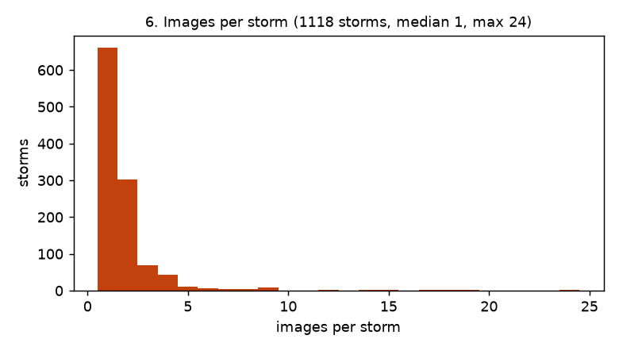
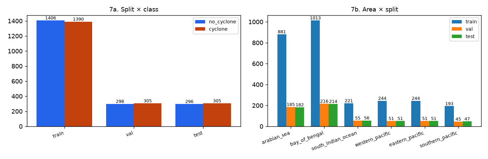
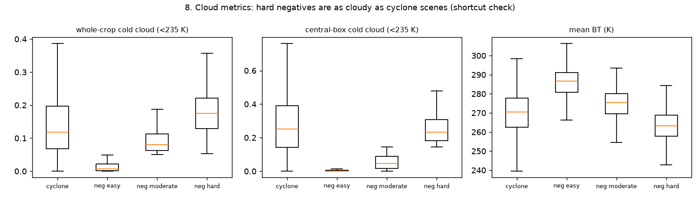

# Dataset v1.0 — VayuDrishti cyclone identification

- **Date created:** 2026-09-12 02:31 UTC
- **Samples:** 4000 = **2000 cyclone** (label 1) + **2000 no_cyclone** (label 0). No image is duplicated.
- **Random seed:** 42 (selection and splits)
- **Manifest:** `data/metadata/identification_dataset.csv`; splits in `data/splits/`.

## Source datasets
- **Dataset A (positives):** PS-70 finalized IBTrACS v04r01 metadata (139,829 fixes, 2,299 storms, 2000–2026) and the
  PS-70 positive candidate workbook (2,000 fixes from 721 storms) derived from it.
- **Dataset B (negatives):** PS-70 GridSat-B1 non-cyclone pool (4,615 North Indian Ocean samples, 2000–2025, rule:
  ≥ 10° from every IBTrACS DS/TS/MX centre) and its 2,000-sample selection.
- **Imagery (both classes):** NOAA GridSat-B1 v02r01 IRWIN CDR (~11 µm), nearest 3-hourly slot, 18°×18° crop
  centred on the sample position, fetched by OPeNDAP subset. One source and one code path for both classes.

## Preprocessing
- Brightness temperature clipped to 180–310 K and mapped linearly to 8-bit (cold = bright), as in the
  original PS-70 downloader; 259×259 crop resized to 256×256 PNG, north up.
- Crops with > 2% missing pixels, constant frames, failed downloads and duplicates are rejected
  (`reports/cleaning_report.md`).

## Sampling strategy
- Positives: only IBTrACS nature TS fixes (non-tropical DS/ET/SS/MX/NR removed: 463); 750 reserve TS fixes drawn from dataset A.
  Stratified by UI subregion × storm intensity (target equal areas, 35/35/30 % weak/medium/strong); shortfalls are
  redistributed to the least-filled strata. PS-70 candidates are preferred, picked round-robin across storms.
- Positive sources: {'ps70_positive_candidates': 1303, 'finalized_metadata_reserve': 697}; storms: 1118.
- Negatives: difficulty by a documented image rule — easy: whole-crop cold cloud (< 235 K) below 5%; hard: central 9°×9° cold-cloud fraction ≥ 0.144 (P25 of the positives); moderate: the rest.
  Clean pool difficulty: {'easy': 3116, 'moderate': 925, 'hard': 452}. Targets {'hard': 0.34, 'moderate': 0.33, 'easy': 0.33}, 50/50 Arabian Sea / Bay of Bengal,
  round-robin over years. 862 of the chosen negatives were also in the PS-70 2,000 selection.

## Distribution

| area | cyclone | no_cyclone |
|---|---|---|
| Arabian Sea | 345 | 903 |
| Bay of Bengal | 346 | 1097 |
| South Indian Ocean | 332 | 0 |
| Western Pacific | 346 | 0 |
| Eastern Pacific | 346 | 0 |
| Southern Pacific | 285 | 0 |

- Positive intensity: {'medium': 727, 'weak': 649, 'strong': 624}
- Negative difficulty: {'easy': 774, 'moderate': 774, 'hard': 452}
- Basins: {'EP': {0: 0, 1: 346}, 'NI': {0: 2000, 1: 691}, 'SI': {0: 0, 1: 332}, 'SP': {0: 0, 1: 285}, 'WP': {0: 0, 1: 346}}

## Split strategy
- StratifiedGroupKFold(n_splits=20, shuffle=True) on label|area|intensity-or-difficulty; 3 folds test, 3 folds val, rest train.
- Groups: 1879 (storm id, overlapping crops within 12 h, near-duplicates); largest group 36 samples (0.9%).
- Rows: {'train': 2796, 'val': 603, 'test': 601} (share {'train': 0.699, 'val': 0.1507, 'test': 0.1502}); cyclone share {'test': 0.5075, 'train': 0.4971, 'val': 0.5058}.
- Positive storms per split: {'test': 169, 'train': 777, 'val': 172}; difficulty per split: {'test': {'easy': 115, 'hard': 67, 'moderate': 114}, 'train': {'easy': 543, 'hard': 317, 'moderate': 546}, 'val': {'easy': 116, 'hard': 68, 'moderate': 114}}.
- **Leakage check:** PASS (`reports/leakage_check.json`).

## Known limitations
- Negatives exist only for the North Indian Ocean. In other basins only recall (detection rate) can be measured.
- Negative crops are centred on an integer-degree grid that includes land; positives are over ocean. Coastlines and
  land surface temperature can act as a geographic cue.
- Intensity is the storm's lifetime category, not the intensity at the imaged fix.
- Labels come from IBTrACS positions and the PS-70 negative rule; `human_verified` is REVIEW_REQUIRED for all rows.

## Figures
 
 
 
 

Sample grids: `figures/samples_positive_{weak,medium,strong}.png`, `figures/samples_negative_{easy,moderate,hard}.png`.
