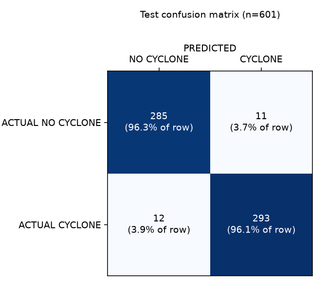
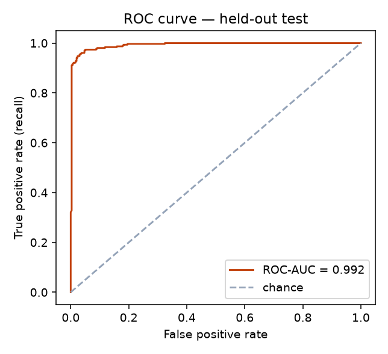
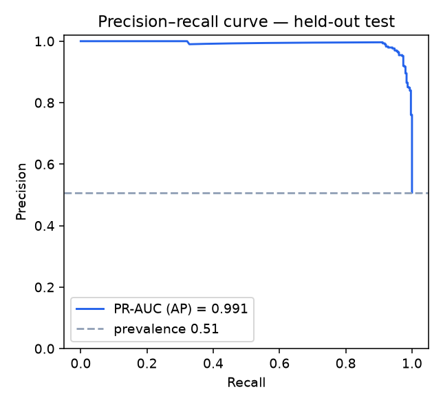
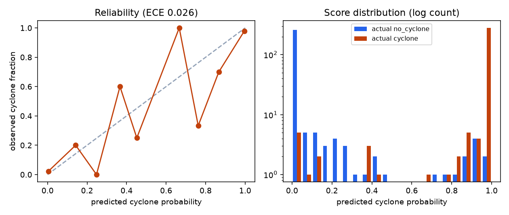

# Model report — VayuDrishti cyclone identification (PS-70, stage 1)

Model **efficientnet_b0** · model version v1 · dataset v1.0 · trained 2026-09-12T02:32:55+00:00 on NVIDIA GeForce RTX 4060 Laptop GPU.
All numbers below are read from the pipeline outputs; test metrics come only from the held-out test split.

## 1. Dataset sources
- **Dataset A (positives):** PS-70 finalized IBTrACS v04r01 metadata — 139,829 fixes, 2,299 storms, seasons 2000–2026, basins NI/SI/WP/EP/SP. The PS-70 positive candidate workbook (2,000 fixes, 721 storms) is a selection from it; 1101 PNGs had been collected (mostly HURSAT-B1).
- **Dataset B (negatives):** PS-70 GridSat-B1 non-cyclone pool — 4,615 North Indian Ocean samples (2000–2025) with the rule “≥ 10° from every IBTrACS DS/TS/MX centre”, plus its 2,000-sample selection. No images.
- **Imagery used for training (both classes):** NOAA GridSat-B1 v02r01 IRWIN CDR (~11 µm), 18°×18° crops at the nearest 3-hourly slot, one code path for both classes. See `reports/dataset_audit.md`.
- No bounding-box annotations exist → binary image classification.

## 2. Dataset size
- **4,000 images: 2,000 cyclone + 2,000 no_cyclone**, no duplicated images.
- Cleaning: 575 rows rejected on metadata, 37 on imagery (`reports/cleaning_report.md`).

## 3. Positive / negative distribution
- Positive intensity (storm lifetime max wind; <34 / 34–63 / ≥64 kt): {'medium': 727, 'weak': 649, 'strong': 624}; 1118 storms; sources {'ps70_positive_candidates': 1303, 'finalized_metadata_reserve': 697}.
- Negative difficulty: {'easy': 774, 'moderate': 774, 'hard': 452}. Hard = central 9°×9° cold-cloud (<235 K) fraction ≥ 0.144 (P25 of positives); easy = whole-crop cold cloud < 5%.

## 4. Regional distribution
| area | cyclone | no_cyclone |
|---|---|---|
| Arabian Sea | 345 | 903 |
| Bay of Bengal | 346 | 1097 |
| South Indian Ocean | 332 | 0 |
| Western Pacific | 346 | 0 |
| Eastern Pacific | 346 | 0 |
| Southern Pacific | 285 | 0 |

Negatives exist only in the North Indian Ocean (Dataset B covers only that basin).

## 5. Split methodology
- StratifiedGroupKFold(n_splits=20, shuffle=True) on label|area|intensity-or-difficulty; 3 folds test, 3 folds val, rest train; seed 42.
- Rows {'train': 2796, 'val': 603, 'test': 601} (shares {'train': 0.699, 'val': 0.1507, 'test': 0.1502}); cyclone share per split {'test': 0.5075, 'train': 0.4971, 'val': 0.5058}.
- Positive storms per split {'test': 169, 'train': 777, 'val': 172}; negative difficulty per split {'test': {'easy': 115, 'hard': 67, 'moderate': 114}, 'train': {'easy': 543, 'hard': 317, 'moderate': 546}, 'val': {'easy': 116, 'hard': 68, 'moderate': 114}}.

## 6. Leakage prevention
- Groups (1,879): same storm id, crops whose boxes overlap within 12 h (event grouping for negatives), near-duplicates; largest group 36 samples.
- **DATA LEAKAGE CHECK: PASS**: identical_image_path_across_splits = 0; identical_pixels_across_splits = 0; near_duplicates_across_splits = 0; storm_ids_shared_train_val = 0; storm_ids_shared_train_test = 0; storm_ids_shared_val_test = 0; groups_across_splits = 0; overlapping_crops_across_splits = 0; manifest_rows_missing_from_splits = 0; rows_in_more_than_one_split = 0.
- `src/train.py` refuses to run unless the check passed for the exact split files (SHA-256 recorded).

## 7. Preprocessing
- BT clipped to 180.0–310.0 K, linear to 8-bit, cold = bright, 256×256 grayscale; north up. Crops with > 2% missing pixels rejected.
- Model input: grayscale → 3 identical channels → resize 224×224 → ImageNet mean/std (mean [0.485, 0.456, 0.406], std [0.229, 0.224, 0.225]).
- Reproduction check vs the original PS-70 PNGs: {'<not recorded>': {'n': 46, 'median_r': 0.214, 'median_r_if_original_flipped': 0.744}, 'NOAA GridSat-B1 v02r01': {'n': 16, 'median_r': 0.208, 'median_r_if_original_flipped': 1.0}, 'NOAA HURSAT-B1 v07b': {'n': 778, 'median_r': 0.195, 'median_r_if_original_flipped': 0.721}}. The GridSat originals are reproduced exactly once flipped vertically — the PS-70 PNGs are stored south-up.

## 8. Augmentation (train only)
- {'rotation_deg': 10, 'scale': [0.85, 1.0], 'hflip': 0.5, 'vflip': 0.5, 'brightness': 0.1, 'contrast': 0.1}.
- Flips are justified because the data spans both hemispheres (cyclonic rotation is mirrored between them); rotations and crops are small so storm structure is kept. Validation/test are resized only.

## 9. Model architecture
- efficientnet_b0 with torchvision IMAGENET1K_V1 (ImageNet) weights; classifier head replaced by a 2-class linear layer. Classes {'0': 'NO_CYCLONE', '1': 'CYCLONE'}. Input [224, 224].
- Backbone is configurable (`--model-name resnet50 | mobilenet_v3_large`); only the baseline was trained.

## 10. Training configuration
| setting | value |
|---|---|
| optimizer | adamw |
| learning_rate | 0.0003 |
| weight_decay | 0.0001 |
| scheduler | cosine |
| batch_size | 32 |
| max_epochs | 30 |
| epochs_run | 16 |
| early_stopping_patience | 6 |
| selection_metric | val_f1 |
| loss | cross-entropy |
| amp | True |
| class_balance | none |
| class_weights | None |
| deterministic | True |
| seed | 42 |
| decision threshold | 0.5 |
| best epoch | 10 |
| training time (min) | 7.58 |

## 11. Validation results (best epoch, threshold 0.5)
- Epoch 10: loss 0.2021, accuracy 0.965, precision 0.973, recall 0.957, F1 0.965.
- Curves: `reports/training_history.png`; per-epoch values: `reports/training_history.csv`.

## 12. Test results (held-out storms / events)
Test split: 601 images (305 cyclone / 296 no_cyclone), 169 storms never seen in training. 95 % intervals: bootstrap over event groups.

| metric | value | 95 % CI |
|---|---|---|
| accuracy | 0.962 | [0.946, 0.976] |
| precision | 0.964 | [0.939, 0.986] |
| recall | 0.961 | [0.939, 0.981] |
| f1 | 0.962 | [0.945, 0.977] |
| roc auc | 0.992 | [0.985, 0.997] |
| pr auc | 0.991 | [0.981, 0.997] |
| false positive rate | 0.037 | [0.016, 0.060] |

North Indian Ocean only (the one area with both classes): n=396 (100 / 296), accuracy 0.952, precision 0.893, recall 0.920, F1 0.906, ROC-AUC 0.985.

## 13. Confusion matrix
|  | PREDICTED NO | PREDICTED CYCLONE |
|---|---|---|
| ACTUAL NO CYCLONE | 285 | 11 |
| ACTUAL CYCLONE | 12 | 293 |

## 14. ROC-AUC
ROC-AUC 0.992 [0.985, 0.997]. 

## 15. PR-AUC
PR-AUC (average precision) 0.991 [0.981, 0.997]. 

## 16. Region-wise performance
Precision/FPR are reported only where both classes have ≥ 20 test samples; recall needs ≥ 20 positives.

| area | cyclone | no_cyclone | recall | precision | F1 | FPR | ROC-AUC | note |
|---|---|---|---|---|---|---|---|---|
| North Indian Ocean | 100 | 296 | 0.920 | 0.893 | 0.906 | 0.037 | 0.985 | all metrics |
| Arabian Sea | 48 | 134 | 0.979 | 0.887 | 0.931 | 0.045 | 0.990 | all metrics |
| Bay of Bengal | 52 | 162 | 0.865 | 0.900 | 0.882 | 0.031 | 0.982 | all metrics |
| South Indian Ocean | 56 | 0 | 1.000 | n/a | n/a | n/a | n/a | recall only — no/too few negatives in this area |
| Pacific Ocean | 149 | 0 | 0.973 | n/a | n/a | n/a | n/a | recall only — no/too few negatives in this area |
| Western Pacific | 51 | 0 | 0.941 | n/a | n/a | n/a | n/a | recall only — no/too few negatives in this area |
| Eastern Pacific | 51 | 0 | 1.000 | n/a | n/a | n/a | n/a | recall only — no/too few negatives in this area |
| Southern Pacific | 47 | 0 | 0.979 | n/a | n/a | n/a | n/a | recall only — no/too few negatives in this area |

Recall by storm intensity:

| intensity | n | recall | missed |
|---|---|---|---|
| medium | 111 | 0.955 | 5 |
| strong | 87 | 1.000 | 0 |
| weak | 107 | 0.935 | 7 |

## 17. Hard-negative performance
| difficulty | n | accuracy (specificity) | false positive rate | false positives |
|---|---|---|---|---|
| easy | 115 | 0.991 | 0.009 | 1 |
| moderate | 114 | 0.991 | 0.009 | 1 |
| hard | 67 | 0.866 | 0.134 | 9 |

- Hard negatives: n=67, accuracy 0.866, false positive rate 0.134.
- Precision with all test positives vs hard negatives only: 0.970 (ROC-AUC 0.975); North Indian Ocean positives vs hard negatives: precision 0.911, ROC-AUC 0.959 (n_pos=100).

## 18. Error analysis
- False positives: 11; false negatives: 12 (`reports/errors/`, `reports/errors/errors.csv`).
- FP rate by difficulty: {'easy': {'n': 115, 'errors': 1, 'rate': 0.0087}, 'hard': {'n': 67, 'errors': 9, 'rate': 0.1343}, 'moderate': {'n': 114, 'errors': 1, 'rate': 0.0088}}.
- FN rate by intensity: {'medium': {'n': 111, 'errors': 5, 'rate': 0.045}, 'strong': {'n': 87, 'errors': 0, 'rate': 0.0}, 'weak': {'n': 107, 'errors': 7, 'rate': 0.0654}}.
- FN rate by area: {'arabian_sea': {'n': 48, 'errors': 1, 'rate': 0.0208}, 'bay_of_bengal': {'n': 52, 'errors': 7, 'rate': 0.1346}, 'eastern_pacific': {'n': 51, 'errors': 0, 'rate': 0.0}, 'south_indian_ocean': {'n': 56, 'errors': 0, 'rate': 0.0}, 'southern_pacific': {'n': 47, 'errors': 1, 'rate': 0.0213}, 'western_pacific': {'n': 51, 'errors': 3, 'rate': 0.0588}}.
- FN rate by lifecycle stage: {'Developing': {'n': 46, 'errors': 1, 'rate': 0.0217}, 'Intensifying': {'n': 58, 'errors': 0, 'rate': 0.0}, 'Mature / Peak': {'n': 49, 'errors': 3, 'rate': 0.0612}, 'Weakening / Dissipating': {'n': 43, 'errors': 2, 'rate': 0.0465}, 'reserve (not staged)': {'n': 109, 'errors': 6, 'rate': 0.055}}.
- Median wind at missed fixes 25.0 kt vs detected 30.0 kt; central cold-cloud fraction FN 0.208 vs TP 0.277; FP 0.302 vs TN 0.026.
- **Missed cyclones:** 7 of 12 belong to weak (depression-strength) storms, 7 were ≤ 25 kt at the imaged fix (4 without a wind value), and 7 are in the Bay of Bengal — disorganised monsoon-season depressions and sheared remnants without a clear central dense overcast.
- **False alarms:** 9 of 11 are hard negatives — large, central deep-convective clusters. A tracked IBTrACS system entered the crop within the next 72 h for 6 of 11 false positives (0.545) vs 25 of 285 true negatives (0.088). The PS-70 negative rule only checks the matched time, so some of these scenes may show pre-genesis disturbances; details: [{'image_id': 'IMG3092', 'timestamp': '2015-07-26T18:00:00Z', 'cyclone_probability': 0.999995, 'system': '2015209N26072 UNNAMED (TS)', 'hours_ahead': 18.0}, {'image_id': 'IMG2942', 'timestamp': '2013-11-04T00:00:00Z', 'cyclone_probability': 0.9456, 'system': '2013310N06066 UNNAMED (DS)', 'hours_ahead': 48.0}, {'image_id': 'IMG2124', 'timestamp': '2002-05-09T18:00:00Z', 'cyclone_probability': 0.930877, 'system': '2002129N08096 UNNAMED (TS)', 'hours_ahead': 18.0}, {'image_id': 'IMG3304', 'timestamp': '2018-05-20T06:00:00Z', 'cyclone_probability': 0.913429, 'system': '2018141N08059 MEKUNU (TS)', 'hours_ahead': 24.0}, {'image_id': 'IMG3138', 'timestamp': '2015-11-06T12:00:00Z', 'cyclone_probability': 0.880596, 'system': '2015312N11084 UNNAMED (TS)', 'hours_ahead': 39.0}, {'image_id': 'IMG2510', 'timestamp': '2007-06-01T00:00:00Z', 'cyclone_probability': 0.793815, 'system': '2007151N14072 GONU (TS)', 'hours_ahead': 6.0}].

Confidence analysis (softmax scores are not calibrated probabilities):
- ECE 0.026; mean confidence 0.981 vs accuracy 0.962; 84.2% of predictions have confidence ≥ 0.99; 12 of 23 errors were made with confidence ≥ 0.9 (median error confidence 0.913). 

Cross-source check — original PS-70 PNGs (other sensor processing) of **test storms only**, flipped to north-up (recall only; all positives):

| original source | n | recall | median p(cyclone) |
|---|---|---|---|
| <not recorded> | 4 | 1.000 | 1.000 |
| NOAA GridSat-B1 v02r01 | 6 | 1.000 | 1.000 |
| NOAA HURSAT-B1 v07b | 98 | 0.990 | 1.000 |

## 19. Limitations
- **Negatives cover only the North Indian Ocean.** For South Indian Ocean, Pacific Ocean, Western Pacific, Eastern Pacific, Southern Pacific only recall can be measured; the false-positive behaviour outside the NIO is unknown and could be worse (no negatives from those climates/backgrounds were ever seen).
- **Geographic confounding:** every negative is an NIO scene (and some are centred over land), while 2/3 of positives come from other basins. Part of the separation can come from background (coastlines, land temperature, latitude/climate) rather than cyclone morphology; the NIO-only and hard-negative numbers are the fairest view.
- **Storm-centred positives:** positives are centred on the IBTrACS position; the model answers “is there a cyclone at the centre of this 18° scene”, not “anywhere in a large image”. Full-disk use needs a sliding window.
- **Label source:** positives follow IBTrACS TS nature and negatives the PS-70 ≥ 10° rule; no human verification (all REVIEW_REQUIRED). Weak (depression-strength) systems are genuinely ambiguous in IR.
- **Intensity** is the storm's lifetime category, not the intensity at the imaged time.
- **Hard negatives** are defined by an image heuristic (cold-cloud amount), not by meteorological labels such as monsoon depressions or disturbances.
- **Calibration:** the softmax confidence is not a calibrated probability.
- **Sample size:** the test set has 601 images from 282 event groups; per-area numbers carry wide uncertainty.
- **Single sensor/channel:** trained on GridSat-B1 IR only; INSAT-3D/3DR imagery or other renderings need domain validation before use.

## 20. Recommended next improvements
1. Add negatives for SI/WP/EP/SP generated with the same IBTrACS distance rule (append them to `candidates.csv`, then re-run fetch → clean → select → split) so precision can be measured in every basin and the geographic shortcut is removed.
2. Add explicit hard negatives from IBTrACS disturbances (DS), monsoon depressions and pre-genesis clusters, and have analysts verify a sample of both classes.
3. Evaluate on INSAT-3D/3DR IR imagery of recent NIO cyclones before operational use; fine-tune if the domain gap is large.
4. Calibrate the scores on validation data (temperature scaling) before showing them as probabilities, and choose the operating threshold from the recall/precision trade-off the forecasters need.
5. Add a land-mask channel or drop land-centred negatives to test how much the background contributes.
6. Compare ResNet50 / MobileNetV3 with the same splits (`python src/train.py --model-name ... --run-name ...`).
